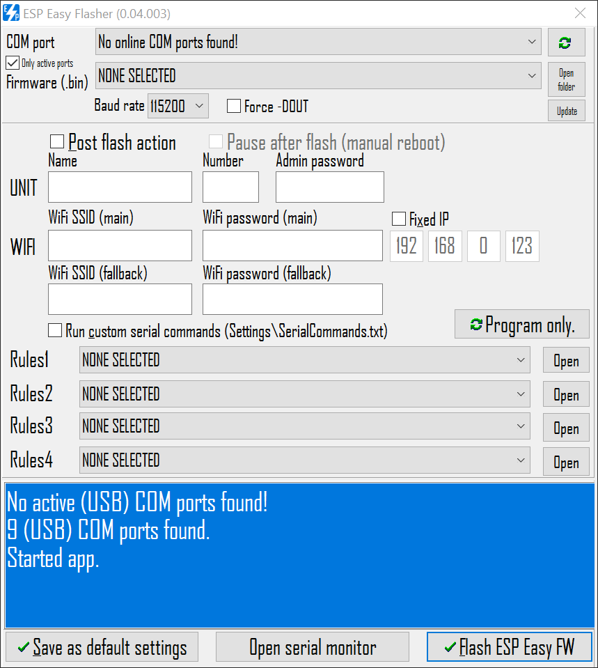

Intro
------------
**ESP Easy Flasher** is a wrapper for the great [ESPTOOL.exe](https://github.com/igrr/esptool-ck/blob/master/README.md) and Power Shell to be able to easily flash and program ESP8266 units with the firmware [ESP Easy](https://www.letscontrolit.com/wiki/index.php/ESPEasy). All needed files are included in the EXE file, just download it and place it where you want it. It will extract needed file structure and missing files automatically. The idea behind the app is to make the flashing and setup of ESP Easy FW as stream lined as possible. It's still a very early stage but should hopefully be functional for most use-cases.

Flash features
------------
* Flash ESP8266 (+ESP8285) using embedded ESPTOOL.exe [0.4.12]
* Use maximum baud rate if wanted
* Use forced DOUT if wanted

Post flash features (for ESP Easy 2.0.0+)
------------
* NO NEED FOR AP MODE setup: set Unit name, number, admin password, Wifi settings, IP, right after flash
* Activate and upload rules (DEPENDING ON THE CONNECTION TO THE UNIT THIS MIGHT TAKE SOME MINUTES DUE TO LATENCY)

EXTRA INFORMATION
------------
* **ONLY WINDOWS** is supported (Windows 10, Windows 8.1, Windows 8, Windows 7) since it rely on PowerShell v2+ to serial communicate with the units.
* **Agency FB** is the font used within the app, if not present the app will kindly ask you to drag-and-drop the two font files found in the APP_DATA folder to the FONTS folder (automatically opened).
* **Admin rights** are needed to be able to get COM port names (driver names).
* **BIN files** need to be placed in the BIN folder (might change in the future but I plan to automatically download new releases from GitHub)
* **Log files** for each flash will be placed in the Log folder.
* **Debug log** is created by: save settings and open the ini file, change debug level 0 to 1, restart app and a bug log file will appear in the same place as the exe. [Debug logs are sent here](https://dbinbox.com/harkrank).

I plan add more features on a weekly basis. Thanks for all the feedback!
